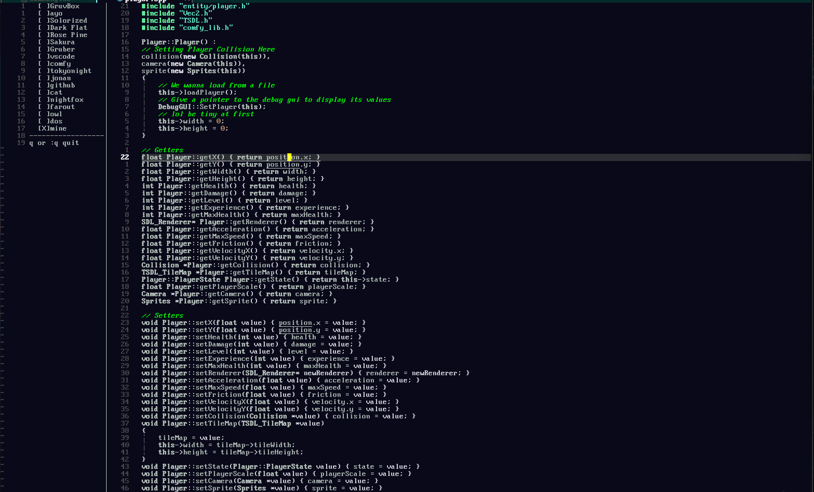
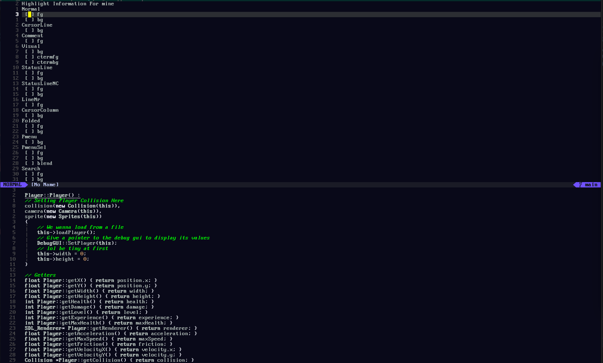
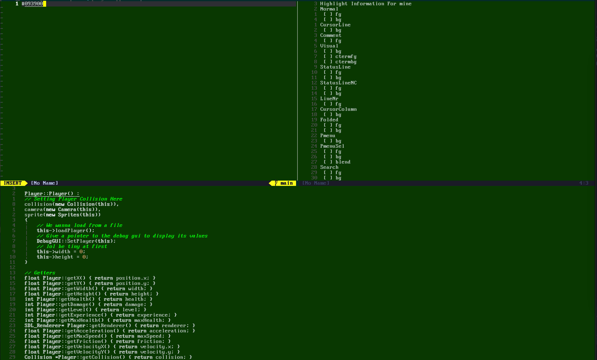

# theme-picker.nvim 🎨

A powerful interactive theme selector & editor for Neovim.

## ✨ Features
- **Switch Themes On The Fly** - Instantly browse and switch themes
- **Preview before applying** – Hover over themes to see how they look
- **Live Theme Editor** – Modify highlight groups such as Normal, CursorLine, Comment, etc.
- **Persistent Customization** – Your custom theme tweaks are saved across sessions
- **Seamless Keybindings & Commands**





## Installation

### Using [lazy.nvim](https://github.com/folke/lazy.nvim):
```lua
{
    'AryanRogye/theme-picker.nvim',
    config = function()
    end
}
```
## Getting Started

### Suggestions

#### Dependencies
This plugin works with any Neovim theme. The following examples use:
- [GruvBox](https://github.com/morhetz/gruvbox)
- [Dark Flat](https://github.com/sekke276/dark_flat.nvim)


Ensure these plugins are installed for the configurations to work as intended. You can install them using your favorite plugin manager, such as [lazy.nvim](https://github.com/folke/lazy.nvim):

```lua
-- Install GruvBox
{
    'morhetz/gruvbox',
    lazy = false
}
```
```lua
-- Install Dark Flat
{
    "sekke276/dark_flat.nvim",
    lazy = false
},
```


 - Having a centralized location for themes - For Example:
 ```lua 
-- File: lua/my-themes.lua
local M = {}

-- Example Themes

M.load_gruvbox = function()
    -- Set GruvBox-specific configurations
        vim.opt.termguicolors = true
    vim.g.gruvbox_contrast_light = 'hard'
    vim.cmd([[colorscheme gruvbox]])
    vim.cmd([[
        highlight Normal guibg=NONE ctermbg=NONE
    ]])
end

M.load_dark_flat = function()
    -- Set dark_flat-specific configurations
    vim.cmd.colorscheme "dark_flat"
end

return M
 ```

### Using The Plugin
```lua
    {
        'AryanRogye/theme-picker.nvim',
        config = function()
--          This is where you load in your themes
--          In the suggestions above it shows how to set something similar
--          There is also an example if you decided not to setup a lua file to load themes
            local theme = require("my-themes")
            require("theme-loader").setup({
--              if this is not set no default theme will need keys or command
                default = 1,    -- default index if no keys set
                themes = {
--                  Load Theme in format name = "" func = func <- Make sure no ()
                    { name = "GruvBox", func = theme.load_gruvbox },
                    { name = "Dark Flat", func = theme.load_dark_flat },
--                  This is if You Directly Want To Load Theme Through Here
--                  { name = "GruvBox", func = function()
--                             Set GruvBox-specific configurations
--                             vim.opt.termguicolors = true
--                             vim.g.gruvbox_contrast_light = 'hard'
--                             vim.cmd([[colorscheme gruvbox]])
--                             vim.cmd([[
--                                highlight Normal guibg=NONE ctermbg=NONE
--                             ]])
--                   end },
                },
                -- Default Values Can Change
                config = {
                    -- How big the bar is
                    ui_col_spacing = 20,
                    opening = "[",
                    closing = "]",
                    selection = "X"
                    -- Preview on j and k
                    preview = true,
                }
            })
            vim.api.nvim_set_keymap("n", "<leader>lu", ":LoadThemeByIndex<CR>", { noremap = true, silent = true })
            vim.api.nvim_set_keymap("n", "<leader>ll", ":LoadThemeByUI<CR>", { noremap = true, silent = true })
            vim.api.nvim_set_keymap("n", "<leader>lp", ":LoadColorPicker<CR>", { noremap = true, silent = true })
            -- Optional
            -- vim.api.nvim_set_keymap("n", "<leader>st", ":SaveThemeState<CR>", { noremap = true, silent = true })
            -- vim.api.nvim_set_keymap("n", "<leader>rt", ":LoadThemeState<CR>", { noremap = true, silent = true })

        end,
    },

```

## Commands

#### Save Theme State if theme is edited by the user with the color picker
```vim
:SaveThemeState
```

#### Reset Theme State if theme is edited by the user with the color picker
```vim
:ResetThemeState
```


## Acknowledgments
- [GruvBox](https://github.com/morhetz/gruvbox) for its vibrant color scheme.
- [Dark Flat](https://github.com/sekke276/dark_flat.nvim) for its clean, minimalist look.
- [lazy.nvim](https://github.com/folke/lazy.nvim) for managing Neovim plugins.
